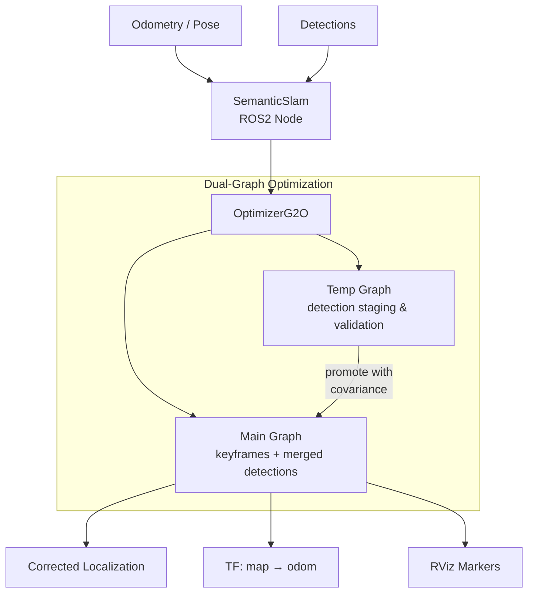

# SemanticSlam

Semantic SLAM system for the [AeroStack2](https://github.com/aerostack2) UAV framework. Fuses odometry
with semantic object detections (ArUco markers, gates) using
[G2O](https://github.com/RainerKuemmerle/g2o) pose-graph optimization to produce drift-corrected
localization.

## Features

- **Dual-graph optimization**: a main graph for long-term state estimation and a temporary graph for
  validating new detections before merging, preventing outlier corruption
- **Semantic landmarks**: supports ArUco markers (full 6-DOF) and gates (3D position)
- **Fixed object anchoring**: known landmark positions can be configured to anchor the graph and bound
  drift
- **Covariance propagation**: extracts per-node covariance from graph marginals when promoting detections
- **Multi-distro ROS2**: builds for Humble and Jazzy via `pixi-build-ros`
- **TF integration**: publishes corrected map → odom transform and localization with covariance

## Installation

Requires [pixi](https://pixi.sh).

```bash
git clone https://github.com/aerostack2/SemanticSlam.git
cd SemanticSlam
pixi install
```

This resolves all dependencies (ROS2, G2O, Eigen3, AeroStack2) through conda channels.

To use a specific ROS2 distribution:

```bash
pixi install -e humble
pixi install -e jazzy    # default
```

## Usage

```bash
# Launch with default config
pixi run ros2 launch as2_semantic_slam semantic_slam_launch.py

# Launch with a specific config and namespace
pixi run ros2 launch as2_semantic_slam semantic_slam_launch.py \
    config_file:=config/tii_config.yaml namespace:=drone1 use_sim_time:=false

# Run the node directly
pixi run ros2 run as2_semantic_slam as2_semantic_slam_node \
    --ros-args --params-file config/config.yaml

# Rebuild after code changes
pixi reinstall ros-jazzy-as2-semantic-slam
```

## Configuration

Parameters are loaded from YAML config files. Three scenarios are provided in `config/`:

| Config | Motion input | Fixed objects | Use case |
|---|---|---|---|
| `config.yaml` | Template (empty) | 4 gates (commented) | Base/template |
| `fronton_config.yaml` | Vision pose | 2 gates | Camera-based UAV |
| `tii_config.yaml` | Odometry | 4 gates | Odometry-based platform |

### Key Parameters

```yaml
odometry_topic: "odometry"                        # nav_msgs/Odometry input
pose_topic: "none"                                 # geometry_msgs/PoseStamped alternative
detections_topic: "processed_gate_poses_array"     # as2_msgs/PoseStampedWithIDArray
map_frame: "drone0/map"
odom_frame: "drone0/odom"
robot_frame: "drone0/base_link"
main_graph_odometry_distance_threshold: 2.0        # meters between keyframes
generate_odom_map_transform: True
```

### Fixed Objects

Known landmark positions can be added to anchor the pose graph:

```yaml
fixed_objects:
  gate_1:
    type: "aruco"        # or "gate"
    pose: [4.0, 1.3, 1.13, 3.14]   # [x, y, z, yaw]
```

## Architecture



The optimizer uses G2O's Levenberg-Marquardt algorithm with a CHOLMOD sparse linear solver.
Keyframes are inserted into the main graph when the robot moves beyond a configurable distance
threshold. Detections accumulate in the temporary graph and are promoted (with covariance) to
the main graph at each new keyframe, then the temporary graph resets.

## License

BSD-3-Clause. See [LICENSE](LICENSE).
